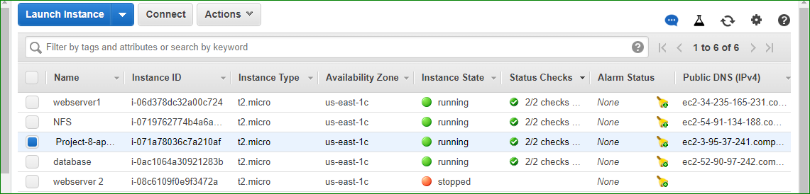
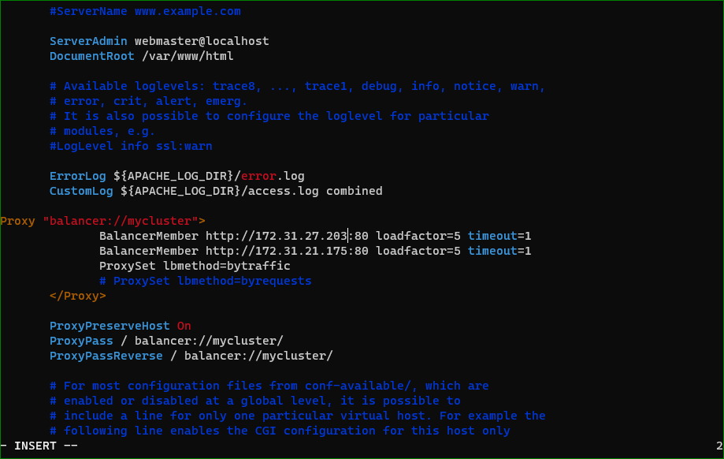
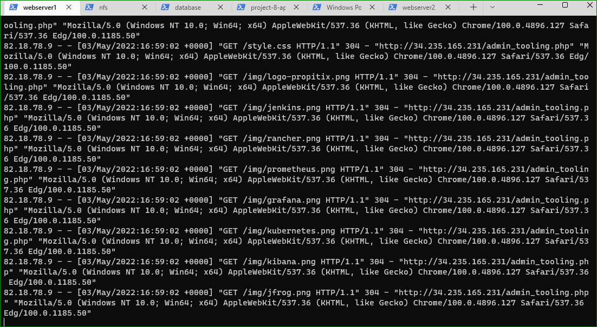
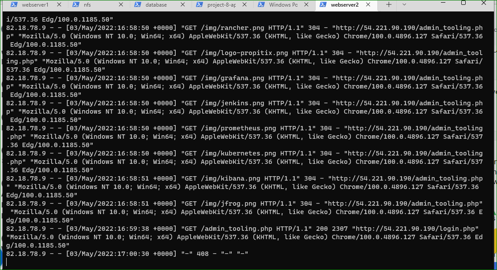
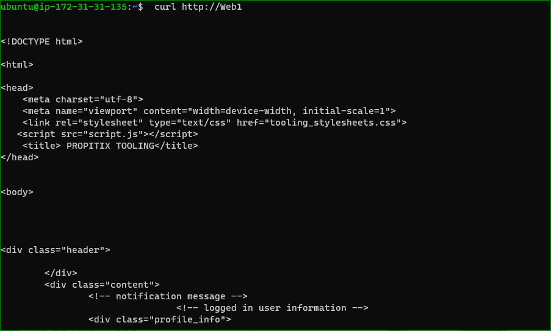
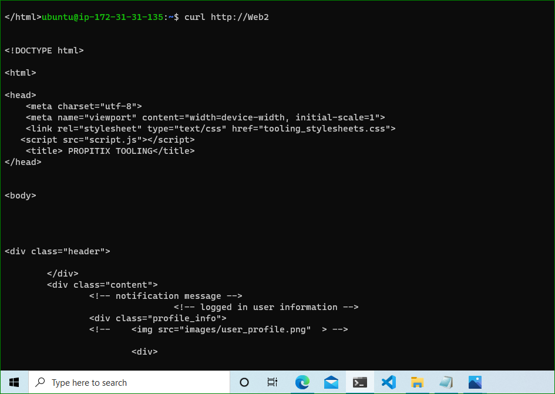

#CONFIGURING APACHE AS A LOAD BALANCER

I created an ubuntu server and named it project-8-apache-lb

I installed apache load balancer on project-8-apache-lb

`sudo apt update`

`sudo apt install apache2 -y`

`sudo apt-get install libxml2-dev`

`sudo a2enmod rewrite`

`sudo a2enmod proxy`

`sudo a2enmod proxy_balancer`

`sudo a2enmod proxy_http`

`sudo a2enmod headers`

`sudo a2enmod lbmethod_bytraffic`

`sudo systemctl restart apache2`

`sudo systemctl status apache2`

`sudo vi /etc/apache2/sites-available/000-default.conf`

`sudo systemctl restart apache2`

http://<Load-Balancer-Public-IP-Address/index.php

`sudo tail -f /var/log/httpd/access_log`

`sudo vi /etc/hosts`

172.31.28.189 web1
172.31.21.175 web2

*I updated my LB config file with Web1 and Web2 instead of the private IP
curl http://Web1
curl http://Web2

